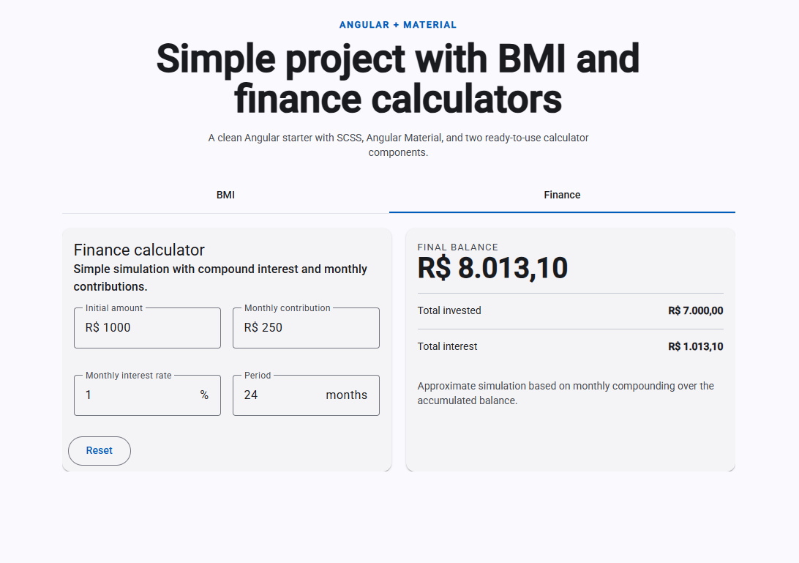

# Calculadoras App

A simple calculator web application built with Angular 21 and Material Design.

## Preview



## Features

- **Finance Calculator** - Perform financial calculations
- **BMI Calculator** - Calculate and track Body Mass Index

## Quick Start

### Prerequisites
- Node.js v18+
- npm v11+

### Installation

```bash
npm install
```

### Development Server

Start the dev server:

```bash
npm start
```

Open `http://localhost:4200/` in your browser.

### Build

```bash
npm run build
```


## Technology Stack

- Angular 21
- Angular Material
- TypeScript
- SCSS
- Vitest
